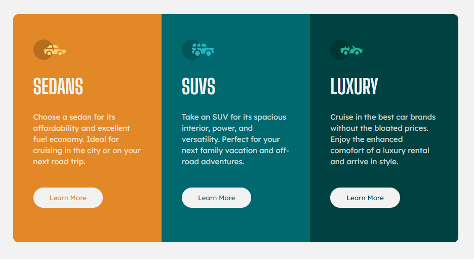

# Frontend Mentor - 3-column preview card component solution

This is a solution to the [3-column preview card component challenge on Frontend Mentor](https://www.frontendmentor.io/challenges/3column-preview-card-component-pH92eAR2-). Frontend Mentor challenges help you improve your coding skills by building realistic projects.

## Table of contents

- [Overview](#overview)
  - [Goal](#goal)
  - [Screenshot](#screenshot)
  - [Links](#links)
- [My process](#my-process)
  - [Built with](#built-with)
  - [What I learned](#what-i-learned)
  - [Useful resources](#useful-resources)
- [Author](#author)
- [Acknowledgments](#acknowledgments)


## Overview

### Goal

Users will be able to:

- View the optimal layout depending on their device's screen size
- See hover states for interactive elements

### Screenshot




### Links

- Solution URL: [GitHub Repo.](https://github.com/aminbabu/FrontendMentorChallenges/tree/master/components/3-column-preview-card-component-main)
- Live Site URL: [GitHub Page](https://aminbabu.github.io/FrontendMentorChallenges/components/3-column-preview-card-component-main)

## My process

### Built with

- Semantic HTML5 markup
- CSS custom properties
- Flexbox
- Mobile-first workflow

### What I learned

Creating equal height columns side by side inside a container using flexbox.

In order to do that, see below:

```css
.container {
  display: flex;
}
```
```css
.container .columns {
  flex: 1;
}
```

## Useful resources
- For any solution, you can take a look on [Stackoverflow](http://stackoverflow.com)

## Author

- Website - [Amin Babu](https://github.com/aminbabu)
- Frontend Mentor - [@aminbabu](https://www.frontendmentor.io/profile/aminbabu)
- Twitter - [@AminBabu_](https://www.twitter.com/AminBabu_)
